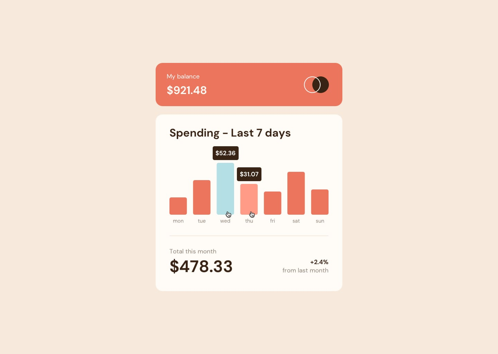

# Frontend Mentor - Expenses chart component

This is a solution to the [Expenses chart component challenge on Frontend Mentor]

## Table of contents

- [The challenge](#the-challenge)
- [Screenshot](#screenshot)
- [Links](#links)
- [Built with](#built-with)

### Screenshot

### Links

- Live Site URL: [Add live site URL here](https://expenses-chart-component-sepia.vercel.app/)

### Built with

- Semantic HTML5 markup
- CSS custom properties
- Flexbox
- CSS Grid
- React js
